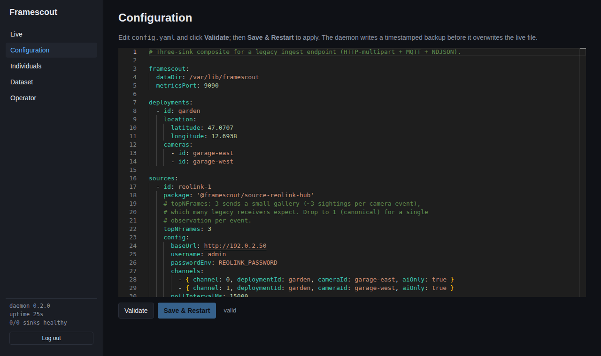
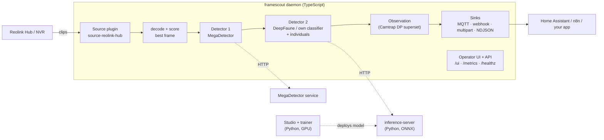

# Framescout

> Wildlife-camera frame pipeline — picks the best frame from every NVR clip, runs a two-stage
> detector chain and ships structured observations to MQTT, webhooks or your own app.
> Source × Detector × Sink plugins in TypeScript. Apache-2.0.

[](https://github.com/Juice-de-Orange/framescout/actions/workflows/ci.yml)
[](https://github.com/Juice-de-Orange/framescout/actions/workflows/python-ci.yml)
[](LICENSE)



## Why

Consumer camera hubs (Reolink Hub Mini, RLN-series NVRs, …) record motion clips, and the
wildlife-camera open-source world has excellent inference models (MegaDetector, DeepFaune,
SpeciesNet) and excellent data tools (Camtrap DP, Wildlife Insights). What is missing is
**the bridge**: a small, always-on runtime that pulls clips off the hub, picks the one frame
worth looking at, asks "is there an animal, and which one?" and hands a clean, standards-aligned
record to whatever you already run — Home Assistant, n8n, or your own web app.

Framescout is that bridge. It is **not** a real-time NVR like Frigate (stream decoding) and not
a desktop batch tool like AddaxAI; it works on the recordings the hub already made.

## Features

- **Best frame per clip** — Tenengrad sharpness × motion × detection confidence × edge penalty,
  so every event yields the single most informative frame.
- **Two-stage detector chain** — MegaDetector finds the animal (and gates out frames with people),
  a species classifier names it: DeepFaune, or **your own model** trained with the bundled trainer.
- **Named individuals** — "which cat was it?" from a handful of reference photos via embedding
  centroids, no retraining when you add an animal.
- **Pluggable everything** — Source, Detector and Sink are small TypeScript interfaces; plugins are
  npm packages with a manifest. Bounded queues and a circuit breaker per sink.
- **Operator UI** — live observation feed, config editor with validation and safe apply/restart,
  individuals and training-dataset management; token login, CSRF and DNS-rebinding protection.
- **Camtrap-DP-aligned observations** — output is a superset of TDWG Camtrap DP 1.0.2.
- **Production-minded** — non-root, read-only, capability-dropped container; secret-redacted
  structured logs; Prometheus metrics; health and readiness endpoints.

## Architecture



Heavy inference (MegaDetector, the species classifier) runs in HTTP services that can live on
another machine — see [`examples/split-host/`](examples/split-host); the daemon decodes, scores
and routes. The one model that runs inside the daemon is the optional
`detector-individual-embed` plugin: the image carries `onnxruntime-node` (CPU) for it, loaded only
when that plugin is configured. Details: [docs/ARCHITECTURE.md](docs/ARCHITECTURE.md).

## Quick start

You need a Reolink hub or NVR on your LAN. For species detection you also need a MegaDetector and
a DeepFaune (or own-model) HTTP service — **this repository does not ship a MegaDetector or
DeepFaune service**. You bring your own HTTP wrapper around those models; the small wire contract
is in [docs/detectors/megadetector-http.md](docs/detectors/megadetector-http.md) and
[docs/detectors/deepfaune-http.md](docs/detectors/deepfaune-http.md). For a classifier you trained
yourself, the bundled [`services/inference-server`](services/inference-server) is that service.
The full walkthrough is in [docs/quickstart.md](docs/quickstart.md).

```bash
git clone https://github.com/Juice-de-Orange/framescout.git && cd framescout
cp .env.example .env          # fill in REOLINK_PASSWORD and friends
$EDITOR config.yaml           # set the hub address, cameras and sinks
docker compose up --build     # builds the daemon image from source
```

**Replace the placeholders in `config.yaml` before the first start.** The shipped file points at
two hosts that do not exist on your network — the hub (`https://192.0.2.50`) and the MQTT broker
(`mqtt://homeassistant.local`) — and at detector endpoints on `localhost`. A source or sink that
cannot be reached at startup is fatal: the daemon logs
`InitFailed: Plugin "…" init() threw an error`, exits with code 1 and the container restarts in a
loop, so the UI never comes up. Set real addresses or delete the entries you do not use
([troubleshooting](docs/troubleshooting.md#the-daemon-wont-start)).

Then open <http://localhost:9090/ui> and log in with the token the daemon generated on first start:
`docker compose exec framescout cat /var/lib/framescout/.ui-token`.

- **Opening the UI from another machine** answers `403 forbidden_origin` until the name or IP you
  type into the browser is listed in `framescout.ui.allowedHosts`
  ([operator UI → first-time auth](docs/operator-ui.md#first-time-auth)).
- **The config editor is validate-only in this compose file.** `config.yaml` is mounted read-only
  into a read-only container, so **Save & Restart** answers `423 config_readonly`; edit the file
  on the host and `docker compose restart`, or mount a writable config directory as described in
  [operator UI → saving from the UI](docs/operator-ui.md#saving-from-the-ui-in-the-hardened-compose).

No image or npm package is published yet. From the first release on, the prebuilt multi-arch image
is `ghcr.io/juice-de-orange/framescout` and the plugins are published under the `@framescout` npm
scope; until then build from source as shown above.

## Built-in plugins

| Kind     | Package                                    | Purpose                                         |
|----------|--------------------------------------------|-------------------------------------------------|
| Source   | `@framescout/source-reolink-hub`           | Reolink Hub Mini, Home Hub, RLN-series NVR      |
| Detector | `@framescout/detector-megadetector-http`   | MegaDetector v6 via HTTP (+ person privacy gate)|
| Detector | `@framescout/detector-deepfaune-http`      | DeepFaune V1.3 (non-commercial weights)         |
| Detector | `@framescout/detector-classify-http`       | Your own classifier via the bundled inference server |
| Detector | `@framescout/detector-individual-embed`    | Named individuals via DINOv2 embeddings         |
| Sink     | `@framescout/sink-mqtt`                    | JSON per topic (Home Assistant)                 |
| Sink     | `@framescout/sink-webhook`                 | Generic JSON POST                               |
| Sink     | `@framescout/sink-http-multipart`          | Multipart POST, canonical or legacy form        |
| Sink     | `@framescout/sink-file-ndjson`             | Local NDJSON spool / audit log                  |

## Tech stack

TypeScript (Node 22, strict ESM) in a pnpm monorepo · zod · pino · prom-client · sharp + ffmpeg ·
Preact + Vite operator UI with Monaco · Astro Starlight docs · Vitest + Playwright ·
Python 3.11 FastAPI + onnxruntime inference server · PyTorch/timm trainer · Docker multi-stage
build · GitHub Actions with release-please, cosign and SBOMs.

## Documentation

User path:
- [Quickstart](docs/quickstart.md) — five-minute setup
- [Operator UI](docs/operator-ui.md) — live feed, config edit, restart
- [Configuration reference](docs/configuration-reference.md) — every YAML key, env var, CLI flag
- [Troubleshooting](docs/troubleshooting.md) — symptom → cause → fix
- [Migrating from a legacy ingest pipeline](docs/migrating-from-a-legacy-ingest.md)

Plugin reference:
- [Source: Reolink Hub](docs/sources/reolink-hub.md)
- [Detector: MegaDetector (HTTP)](docs/detectors/megadetector-http.md)
- [Detector: DeepFaune (HTTP)](docs/detectors/deepfaune-http.md) ·
  [DeepFaune license FAQ](docs/deepfaune-license-faq.md)
- [Sink: HTTP Multipart](docs/sinks/http-multipart.md) ·
  [MQTT](docs/sinks/mqtt.md) ·
  [Webhook](docs/sinks/webhook.md) ·
  [File NDJSON](docs/sinks/file-ndjson.md)

Developer + ops:
- [Architecture](docs/ARCHITECTURE.md) — plugin API, pipeline, trust model
- [Data model](docs/data-model.md) — Observation, Camtrap-DP alignment, DeepFaune taxonomy
- [Individual recognition](docs/INDIVIDUAL-RECOGNITION.md) and
  [custom species classifier](docs/SPECIES-CLASSIFIER.md)
- [Plugin author guide](docs/plugin-author-guide.md)
- [Observability](docs/observability.md) — log fields + Prometheus metrics
- [Development](docs/DEVELOPMENT.md) — local setup, tests, troubleshooting

Project:
- [Foundation](docs/FOUNDATION.md) — v0.2 design record and ADRs
- [v0.1 scope & acceptance](docs/V0.1-SCOPE.md) — historical scope document
- [Roadmap](docs/ROADMAP.md)

## Status & roadmap

Pre-1.0 and under active development; `v0.2.0` is the first public release. The plugin API is
frozen at `0.1` until the next planned bump (hot-reload via `reconfigure()`, v0.3). Next up:
local ONNX inference in the daemon, Camtrap DP / GBIF export, more sources (ONVIF, UniFi Protect,
Frigate events) — see [docs/ROADMAP.md](docs/ROADMAP.md) and the
[issues](https://github.com/Juice-de-Orange/framescout/issues).

## Contributing

Contributions are welcome — start with [CONTRIBUTING.md](CONTRIBUTING.md) and the issues labelled
[`good first issue`](https://github.com/Juice-de-Orange/framescout/labels/good%20first%20issue).
Security reports: see [SECURITY.md](SECURITY.md). This project follows the
[Contributor Covenant](CODE_OF_CONDUCT.md).

## Built with Claude Code

Most of Framescout was written in pair-programming sessions with
[Claude Code](https://claude.com/claude-code), Anthropic's coding agent: design documents,
implementation, tests and audits. Architecture, review and release decisions are the
maintainer's. [`CLAUDE.md`](CLAUDE.md) is the working agreement the agent follows in this
repository.

## License

Apache-2.0 — see [LICENSE](LICENSE).

The `@framescout/detector-deepfaune-http` plugin's upstream **model weights** are licensed
CC BY-NC-SA 4.0 (non-commercial) — see that plugin's README. The plugin's TypeScript code is
Apache-2.0; only the model file you point it at is restricted.
